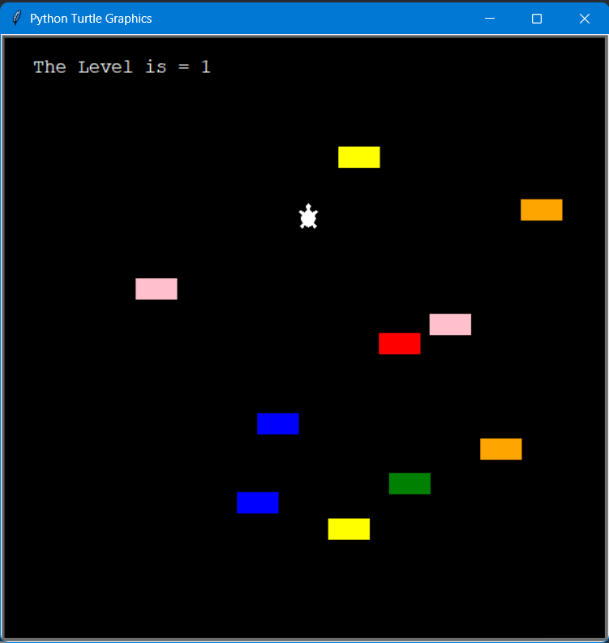

This image shows a Python Turtle Graphics window displaying a simple game scene.
There is a small white turtle character in the center, and several colored rectangular blocks (yellow, pink, red, blue, green, orange) scattered around the screen.

The background is black, and at the top-left corner the text “The Level is = 1” is written, indicating the current level of the game.
It appears to be a level-based obstacle or movement game created using Python Turtle.
